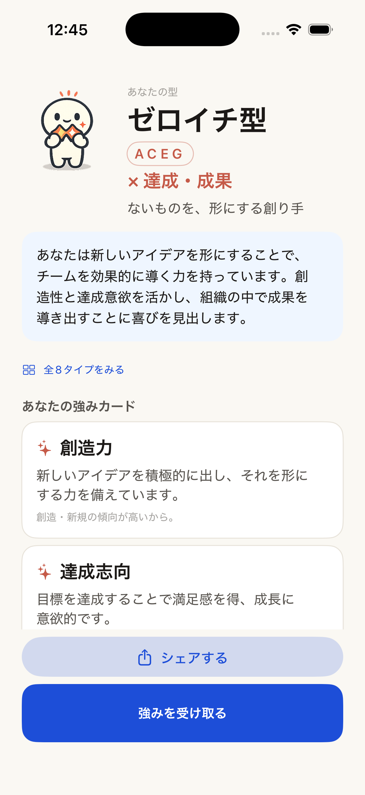
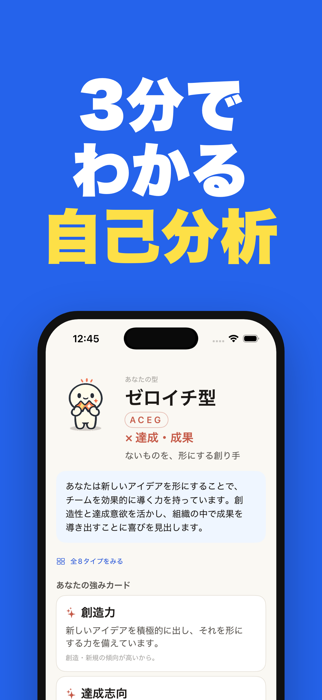

# appstore-shots

Turn your raw app screenshots into App Store listing images — bold headline,
device frame, colored background — at the exact pixel sizes App Store Connect
wants. No Figma, no design skills, just a small JSON file.

<p align="center">
  
  &nbsp;&nbsp;➡&nbsp;&nbsp;
  
</p>

<p align="center"><sub>Left: a raw screenshot. Right: rendered by appstore-shots (1290×2796, ready to upload).</sub></p>

## Two ways to use it

- **Web app — no install, no terminal.** Drag in your screenshots, type the
  headlines, pick colors, download. Everything runs in your browser; images are
  never uploaded anywhere. → see [`web/`](web/) (deploy to Vercel, or run
  `cd web && npm install && npm run dev`).
- **CLI — for developers.** Version-control a `spec.json` and regenerate the
  whole set in seconds. See below.

## Why

Making App Store screenshots usually means fighting a design tool for an
afternoon. This does it from a JSON file you can version-control and re-run in
seconds — every time you change a screen, regenerate the whole set.

It renders HTML/CSS with headless Chromium, authoring the layout in logical
points and multiplying by the device scale factor — so output is always the
exact required size, never off by a rounding error.

## Quick start

```bash
# 1. one-time: download the Chromium that does the rendering
npx playwright install chromium

# 2. scaffold a spec from a folder of screenshots
npx appstore-shots init ./screenshots spec.json

# 3. edit headlines/colors in spec.json, then render
npx appstore-shots render spec.json
# -> appstore-output/6.9/01.png, 02.png, ...
```

That's it. The PNGs in `appstore-output/6.9/` are ready to drag into App Store
Connect.

## The spec

One JSON file describes the whole set. Defaults apply to every frame; any frame
can override them.

```json
{
  "device": "iphone-6.9",
  "outDir": "appstore-output",
  "defaults": {
    "background": "#2563eb",
    "accent": "#fde047",
    "foreground": "#ffffff",
    "template": "headline-top"
  },
  "frames": [
    { "screenshot": "screenshots/home.png",   "headline": "Know yourself\nin **3 minutes**" },
    { "screenshot": "screenshots/result.png", "headline": "See your\n**strengths**" },
    { "screenshot": "screenshots/share.png",  "headline": "**Share** your results",
      "template": "headline-overlay", "background": "#0f172a", "accent": "#38bdf8" }
  ]
}
```

- `**word**` renders in the accent color.
- `\n` is a line break (keep lines short — long lines wrap).
- Per-frame keys: `background`, `accent`, `foreground`, `headline`, `subhead`,
  `headlineFont`, `headlineSize`, `frameColor`, `deviceWidth`, `template`, `index`.

See [`examples/spec.example.json`](examples/spec.example.json).

## Templates

| Template | Look |
|---|---|
| `headline-top` | Heavy headline up top, phone below (default) |
| `headline-bottom` | Whole phone up top, headline below |
| `headline-overlay` | Big phone, headline floating over the top |
| `full-bleed` | Rounded screenshot, no device frame |

## Devices

```bash
npx appstore-shots devices
```

| `device` | Output px | Notes |
|---|---|---|
| `iphone-6.9` | 1290 × 2796 | The only iPhone size App Store Connect requires |
| `iphone-6.5` | 1242 × 2688 | |
| `ipad-13` | 2064 × 2752 | |

## Use it inside Claude Code

This repo is also a Claude Code plugin. If you use Claude Code, you can let it
drive the tool for you — drafting copy, picking templates, iterating:

```
/plugin marketplace add takepon7/appstore-shots
/plugin install appstore-shots@appstore-shots
```

Then just ask: *"make App Store screenshots from ./screenshots"*.

## Notes & limits

- Headlines are best at ~5 full-width Japanese chars (or ~10 Latin) per line.
  Drop `headlineSize` to ~64 for longer copy.
- Default font is the system heavy weight. For a rounded extra-bold look, set
  `headlineFont` to a web font like `M PLUS Rounded 1c` (see the design guide in
  the plugin's `references/`).
- Scope is image generation only — no App Store Connect upload, no App Preview
  video, no Android sizes yet. PRs welcome.

## License

MIT © takepon7
